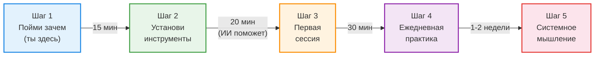
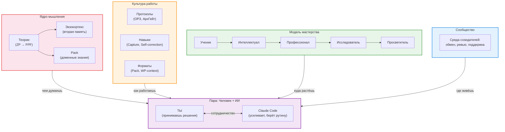
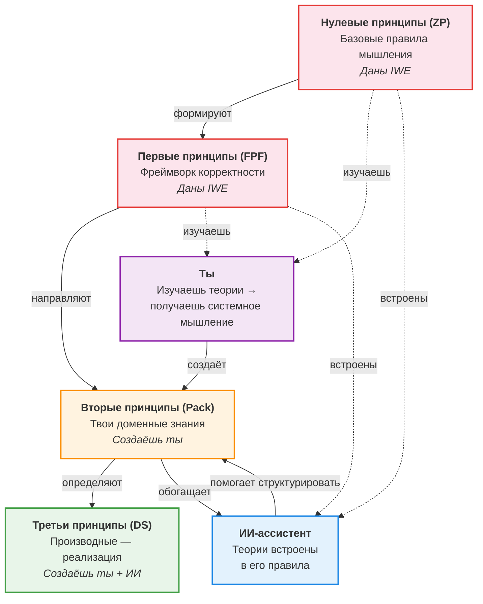

# IWE для новичков: операционная система интеллектуальной работы

> **С чего начать:** хочешь сразу действовать → [QUICK-START.md](../QUICK-START.md) (15 минут). Работаешь через браузер (claude.ai), без VS Code → [BROWSER-CI-TEMPLATE.md](../BROWSER-CI-TEMPLATE.md). Этот файл - концептуальное введение: что такое IWE и зачем она нужна.

> **Для кого:** Для тех, кто впервые слышит об IWE и не знает, что такое GitHub, VS Code или командная строка. Это нормально. Ты в правильном месте.
>
> **Что получишь:** Понимание того, что такое IWE, из чего она состоит, зачем нужна — и как начать, не будучи программистом.

---

## 1. Твоя проблема (и она реальна)

Узнаёшь себя?

**Знания теряются.** Ты читаешь книгу, слушаешь лекцию, делаешь заметки — а через месяц не можешь найти ту самую мысль. Или находишь, но не помнишь контекст. Заметки в Notion, блокноте, телефоне, на салфетке — везде и нигде.

**Планы не работают.** Ты составляешь план на неделю, а к среде он уже неактуален. Новые задачи вытесняют старые. Нет системы приоритетов, нет ревью — только ощущение, что ничего не успеваешь.

**ИИ не помогает по-настоящему.** Ты пробовал ChatGPT или Claude — получал красивые, но общие ответы. Каждый раз начинаешь с нуля. ИИ не знает о тебе ничего: ни о твоих проектах, ни о твоих целях, ни о том, что ты уже пробовал.

---

## 2. Как IWE это решает

IWE — это **Intellectual Work Environment**, операционная система интеллектуальной работы. Как Ubuntu — это не просто набор программ, а дистрибутив (ядро + пакеты + конфигурация + сообщество), так и IWE — это методология + готовое окружение + сопровождение.

### Четыре компонента IWE

```
IWE — операционная система интеллектуальной работы

  Ядро мышления      — чем думаешь (теории, принципы, различения)
  Культура работы    — как работаешь (протоколы, навыки, форматы)
  Модель мастерства  — куда растёшь (от Ученика к Просветителю)
  Сообщество         — где живёшь (среда созидателей)
```

**Важно:** IWE — это инструмент. Но за инструментом стоят теории (системное мышление, менеджмент, инженерия) и культура работы (14 элементов: протоколы, навыки, форматы). Без теорий инструмент останется блокнотом с ИИ. С теориями — становится экзотелом для мышления.

### Как компоненты решают проблемы

| Проблема | Компонент IWE | Как работает |
|----------|--------------|-------------|
| Знания теряются | **Ядро мышления** (экзокортекс + Pack) | Каждая единица знания — в своём месте. ИИ помогает извлекать и структурировать. История изменений хранится в GitHub |
| Планы не работают | **Культура работы** (ритуалы ОРЗ + Claude Code) | Утром — план дня (автоматически). Вечером — итоги. Каждую неделю — ревью. ИИ не даёт забыть незавершённое |
| ИИ не помогает | **Ядро мышления + культура работы** | ИИ читает ТВОИ файлы, знает ТВОИ цели, помнит ТВОЮ историю. Это персональный ассистент, а не обезличенный чат-бот |
| Не знаю, куда расти | **Модель мастерства** | Чёткая траектория: от новичка до эксперта. Каждый уровень мастерства — конкретные навыки и результаты |
| Один на один с проблемами | **Сообщество** | Среда созидателей: обмен опытом, ревью, поддержка |

> Подробнее о каждом сценарии: [Планирование дня](https://github.com/TserenTserenov/PACK-digital-platform/blob/main/pack/digital-platform/08-service-clauses/DP.SC.001-daily-planning.md) | [Планирование недели](https://github.com/TserenTserenov/PACK-digital-platform/blob/main/pack/digital-platform/08-service-clauses/DP.SC.002-weekly-planning.md) | [Развитие и обучение](https://github.com/TserenTserenov/PACK-digital-platform/blob/main/pack/digital-platform/08-service-clauses/DP.SC.003-learning-and-development.md) | [Захват знаний](https://github.com/TserenTserenov/PACK-digital-platform/blob/main/pack/digital-platform/08-service-clauses/DP.SC.004-knowledge-capture.md)

---

## 3. Твой путь: от нуля до рабочего IWE



### Шаг 1. Пойми зачем (ты уже здесь)

Ты читаешь этот документ — значит, первый шаг сделан. Ты понимаешь, что текущий способ работы с информацией не масштабируется. Это важное осознание.

### Шаг 2. Установи инструменты (~20 минут)

Тебе **не нужно** разбираться в программировании. Установка IWE — это три действия:

1. Установить Claude Code (бесплатно)
2. Создать аккаунт на GitHub (бесплатно)
3. Запустить одну команду, которая настроит всё остальное

> **ИИ поможет.** Если ты уже поставил Claude Code — просто скажи ему: «Помоги мне установить IWE». Он проведёт тебя через каждый шаг.
>
> Подробная инструкция: [SETUP-GUIDE.md](../SETUP-GUIDE.md)

**Что нужно (минимум):**
- Компьютер (Mac, Linux или Windows с WSL)
- Подписка Claude Pro (~$20/мес) — для Claude Code
- GitHub аккаунт (бесплатно)

### Шаг 3. Первая стратегическая сессия (~30 минут)

После установки ты запускаешь Claude Code и проводишь первую сессию:
- Заполняешь стратегический документ (кто ты, что важно, куда двигаешься)
- Формулируешь 3-5 рабочих продуктов (задач) на ближайшую неделю
- ИИ структурирует это в план

Это не абстрактное упражнение — ты сразу получаешь работающий план.

> Подробнее: [SETUP-GUIDE.md, этап 2](../SETUP-GUIDE.md)

### Шаг 4. Ежедневная практика (1-2 недели)

Каждый день — один и тот же ритм:
- **Утро:** «Открой день» → Claude показывает план, события, на чём остановился
- **Работа:** Работаешь, фиксируешь выводы на рубежах
- **Вечер:** «Закрой день» → Claude записывает итоги, обновляет планы

Через неделю ты почувствуешь разницу: ничего не теряется, всё на своих местах.

> Подробнее: [LEARNING-PATH.md, §5 — Повседневная работа](../LEARNING-PATH.md)

### Шаг 5. Системное мышление (когда будешь готов)

После 1-2 недель практики ты заметишь, что IWE — это больше, чем инструменты. Она построена на определённых принципах. Освоение этих принципов — следующий уровень. Подробнее — в [разделе 6](#6-карта-iwe-что-внутри).

---

## 4. Не бойся

### «Я не программист»

Ты и не должен быть. IWE — операционная система для интеллектуальной работы, не для программирования. Ты пишешь тексты, планы, заметки. GitHub — просто надёжное хранилище. Ты не будешь писать код.

### «GitHub, CLI, терминал — это страшно»

Только в первый раз. Вот что тебе реально нужно знать:
- **GitHub** — место, где хранятся файлы (как Google Drive, но с историей)
- **Терминал** — окно, в которое ты вводишь команды текстом (Claude Code подскажет, что вводить)
- **CLI** — просто способ общения с компьютером через текст вместо кнопок

После установки ты будешь взаимодействовать в основном с Claude Code — на обычном русском языке.

### «Это слишком сложная система»

IWE — это не монолит, который нужно освоить целиком. Это модульная ОС. **Путь подключения IWE** — добавляешь компоненты в свою среду по мере надобности:

| Этап | Что подключаешь | Что получаешь |
|------|----------------|---------------|
| **Этап 1 — Старт** | Claude Code + экзокортекс | Персональный ИИ-ассистент, который тебя помнит |
| **Этап 2 — Ритуалы** | + ОРЗ + план дня | Структурированная работа без потери контекста |
| **Этап 3 — База знаний** | + Pack + бот | База знаний + мобильный доступ |
| **Этап 4 — Автоматизация** | + роли + агенты | ИИ-агенты, которые работают самостоятельно |

> **Этапы = что физически настраиваешь в своей среде** (не уровень мастерства и не тир доступа). Не путать: «Шаг 1-4» выше = порядок первого знакомства; тиры доступа платформы (T0→T4) → [DP.ARCH.002]; ступень развития (cp-профиль) → FORM.089. Подробнее о тирах доступа: [LEARNING-PATH.md, §9](../LEARNING-PATH.md).

### «ИИ сделает всё за меня?»

Нет. И это принципиально. IWE — это **экзотело, а не протез**.

- **Протез** заменяет способность. Ты перестаёшь думать, потому что ИИ думает за тебя.
- **Экзотело** расширяет способность. Это партнёр, который живёт на ноутбуке, телефоне, в роботе. Ты думаешь лучше, потому что ИИ берёт на себя рутину: напоминает, структурирует, находит связи.

Твоё мышление — главный ресурс. ИИ помогает его не растрачивать на поиск файла или восстановление контекста.

> Подробнее: [Принципы vs Навыки](../principles-vs-skills.md)

---

## 5. Четыре компонента подробнее

### Ядро мышления — чем думаешь

За IWE стоят конкретные **теории**: системное мышление, менеджмент, инженерия предприятия, методология. Эти теории организованы в иерархию принципов (ZP → FPF → Pack → DS) и встроены в правила ИИ-ассистента. Подробнее — в [разделе 7](#7-теории-и-культура-работы--фундамент-iwe).

**Экзокортекс** — твоя вторая память. Набор файлов, которые ИИ-ассистент (Claude Code) читает и обновляет. Когда ты начинаешь работу — он знает, на чём ты остановился вчера. Когда заканчиваешь — записывает выводы. Ты больше не теряешь контекст между сессиями.

**Pack** — база знаний по предметной области. Если ты изучаешь, например, маркетинг — твои выжимки, правила, различения складываются в Pack. Это не папка с закладками, а структурированная библиотека, где каждая единица знания — на своём месте.

### Культура работы — как работаешь

Культура работы — это не абстрактная ценность. Это **14 конкретных элементов**, разделённых на три типа:

| Тип | Что это | Примеры |
|-----|---------|---------|
| **Протоколы** | Формализованные последовательности (делаешь по шагам) | ОРЗ, АрхГейт, Day Open/Close |
| **Навыки** | То, что нарабатываешь (применяешь по ситуации) | Capture, Self-correction, различения |
| **Форматы** | Как оформляешь результат (по стандарту) | Pack-структура, WP-context, Collapsible sections |

**Ритуалы ОРЗ** (Открытие → Работа → Закрытие) — главный протокол. Простой паттерн, который повторяется на каждом масштабе. Начинаешь день — Открытие (что сегодня делаю?). Работаешь — Работа (фиксирую знания на рубежах). Заканчиваешь — Закрытие (что сделал, что дальше).

### Модель мастерства — куда растёшь

Чёткая траектория от новичка до эксперта. Каждый уровень мастерства — конкретные навыки и результаты. Ты всегда знаешь, где находишься и что осваивать дальше.

### Сообщество — где живёшь

Среда созидателей: обмен опытом, ревью, поддержка. Не форум с вопросами, а место, где формируется культура и смыслы.

### Ты + Claude Code = пара

В центре IWE — **ты**. Ты принимаешь решения, мыслишь, направляешь. Claude Code — твой напарник: он усиливает, структурирует, берёт на себя рутину. Но решения — всегда за тобой.

### Инструменты (средства доставки)

Инструменты — это не IWE. Это **средства доставки** четырёх компонентов:

**Claude Code** — ИИ-ассистент, который работает прямо в терминале. Он не просто отвечает на вопросы — он читает твои файлы, помогает планировать, напоминает о незавершённых делах. Это твой напарник, а не поисковик.

**GitHub** — облачное хранилище с полной историей изменений. Ты всегда можешь вернуться к любой версии любого файла.

**VS Code** — бесплатный редактор. На старте не нужен — Claude Code работает в терминале. VS Code понадобится позже, когда захочешь самостоятельно просматривать файлы.

**Бот @aist_me_bot** — помощник в Telegram. Отвечает на вопросы по твоей базе знаний, напоминает о задачах. Не нужно открывать компьютер, чтобы оставаться на связи с IWE.

Подробнее о теориях — в [следующих разделах](#6-карта-iwe-что-внутри).

---

## 6. Карта IWE: что внутри

Теперь, когда ты знаешь зачем каждый компонент — вот как они связаны:



**Четыре компонента — и ты в центре:**

| Компонент | Что это | Простая аналогия |
|-----------|---------|-----------------|
| **Ядро мышления** | Теории + экзокортекс + Pack. Фундамент, на котором строится всё | Операционная система (ядро Linux) |
| **Культура работы** | Протоколы, навыки, форматы — 14 элементов | Стандартные утилиты (ls, grep, git) |
| **Модель мастерства** | Траектория от новичка до эксперта | Система пакетов (apt install) |
| **Сообщество** | Среда созидателей: обмен, ревью, поддержка | Форум + репозитории (GitHub community) |

> **Инструменты** (Claude Code, VS Code, GitHub, бот) — это средства доставки. Как железо, на котором работает ОС.

---

## 7. Теории и культура работы — фундамент IWE

Ты можешь установить все инструменты, настроить ритуалы, начать вести планы — и всё равно не получить максимум от IWE. Почему?

Потому что **IWE — это инструмент, но за инструментом стоят теории и культура работы**. Без них инструмент останется блокнотом с ИИ.

### Теории: откуда берутся принципы

IWE опирается на корпус теорий, которые преподаются в курсах [Школы системного менеджмента](https://system-school.ru/):
- **Системное мышление** — видеть целое, а не только части
- **Методология** — различения, описания методов, рабочие продукты
- **Инженерия предприятия** — как устроены организации и проекты
- **Менеджмент** — руководство, лидерство, стратегирование

Эти теории организованы в иерархию принципов:



| Уровень | Кто создаёт | Кто использует | Пример |
|---------|-------------|---------------|--------|
| **Нулевые (ZP)** | IWE | Ты + ИИ | Базовые правила мышления |
| **Первые (FPF)** | IWE | Ты + ИИ | Фреймворк корректности, различения |
| **Вторые (Pack)** | Ты | Ты + ИИ | Твои знания по маркетингу, управлению, инженерии |
| **Третьи (DS)** | Ты + ИИ | Ты + ИИ | Конкретные планы, код, процессы |

### Культура работы: 14 элементов

Культура работы — второй компонент IWE. Это не «мотивация» и не «привычки». Это **проектируемый набор методов**, разделённых на три типа:

| Тип | Что это | Примеры | Как осваивается |
|-----|---------|---------|-----------------|
| **Протоколы** | Делаешь по шагам (формализовано) | ОРЗ, АрхГейт, Day Open/Close | Следуешь инструкции → автоматизм |
| **Навыки** | Применяешь по ситуации (нарабатывается) | Capture, Self-correction, различения | Практика → обратная связь → мастерство |
| **Форматы** | Оформляешь по стандарту | Pack-структура, WP-context | Используешь шаблон → привыкаешь |

Культура работы — это то, за что платят. Инструмент можно скопировать, теории можно прочитать. Но поставленная культура работы — это результат практики, которую нельзя пропустить.

### Что такое системное мышление (простыми словами)

Это **результат** изучения теорий и применения культуры работы. Умение видеть **целое**, а не только части:

- Ты планируешь неделю. Без системного мышления — список задач. С ним — понимание, какие задачи связаны, какая блокирует другую, что важнее стратегически.
- Ты читаешь книгу. Без системного мышления — конспект цитат. С ним — различения и принципы, которые можно применить в разных контекстах.
- Ты используешь ИИ. Без системного мышления — случайные вопросы. С ним — точные запросы, потому что понимаешь структуру своей работы.

### Почему без этого IWE не раскроется

IWE использует конкретные концепции из теорий:

| Концепция | Из какой теории | Где в IWE | Что это значит |
|-----------|----------------|-----------|----------------|
| **Различения** | Методология | Pack, экзокортекс | Точно определить, чем одно отличается от другого |
| **Описания методов** | Методология | Ритуалы ОРЗ | Понимание «как», а не только «что» |
| **Рабочие продукты** | Системная инженерия | Планирование, ревью | Фокус на результатах, а не на активностях |
| **Роли** | Менеджмент | Стратег, Экстрактор | Разделение: кто что делает (включая ИИ) |

Ты можешь начать пользоваться IWE **без** глубокого понимания этих концепций. Но чтобы по-настоящему раскрыть потенциал — стоит в них разобраться. И чем больше ты изучаешь — тем умнее становится и твой ИИ-напарник, потому что ты наполняешь Pack знаниями.

### Как начать изучать

1. **Первая неделя:** Просто пользуйся IWE. Привыкни к ритуалам ОРЗ. Не углубляйся в теорию.
2. **Вторая неделя:** Прочитай [Принципы vs Навыки](../principles-vs-skills.md) — это 10-минутное введение в философию IWE.
3. **Далее:** Изучай [LEARNING-PATH.md, §3 — Фундамент мышления](../LEARNING-PATH.md) в своём темпе. Бот @aist_me_bot поможет с вопросами.

> Рекомендуемые курсы: [Школа системного менеджмента](https://system-school.ru/) — курсы, на теориях которых IWE построена. В первую очередь: «Системное саморазвитие», «Системное мышление», «Методология».

---

## Ссылки и ресурсы

### Начать сейчас

| Ресурс | Что это | Ссылка |
|--------|---------|--------|
| Пошаговая установка | 7 этапов, от нуля до рабочей IWE | [SETUP-GUIDE.md](../SETUP-GUIDE.md) |
| Путь обучения | Полная программа освоения (11 разделов) | [LEARNING-PATH.md](../LEARNING-PATH.md) |
| Быстрый справочник | FAQ + план на 4 дня | [LEARNING-PATH.md, §11](../LEARNING-PATH.md) |

### Понять глубже

| Ресурс | Что это | Ссылка |
|--------|---------|--------|
| Что такое IWE | Главное определение, архитектура, контуры | [DP.IWE.001](https://github.com/TserenTserenov/PACK-digital-platform/blob/main/pack/digital-platform/02-domain-entities/DP.IWE.001-intelligent-working-environment.md) |
| Шаблон и настройка | Компоненты, роли, FAQ | [DP.IWE.002](https://github.com/TserenTserenov/PACK-digital-platform/blob/main/pack/digital-platform/02-domain-entities/DP.IWE.002-iwe-template-and-setup.md) |
| Принципы vs Навыки | Почему принципы важнее инструментов | [principles-vs-skills.md](../principles-vs-skills.md) |
| Терминология | Словарь IWE | [ONTOLOGY.md](../../ONTOLOGY.md) |

### Сценарии использования

| Сценарий | Обещание | Ссылка |
|----------|----------|--------|
| Планирование дня | DayPlan к 08:00 с приоритетами и контекстом | [DP.SC.001](https://github.com/TserenTserenov/PACK-digital-platform/blob/main/pack/digital-platform/08-service-clauses/DP.SC.001-daily-planning.md) |
| Планирование недели | WeekPlan (с секцией «Итоги W{N}») | [DP.SC.002](https://github.com/TserenTserenov/PACK-digital-platform/blob/main/pack/digital-platform/08-service-clauses/DP.SC.002-weekly-planning.md) |
| Развитие и обучение | Q&A, проверка ДЗ, марафоны | [DP.SC.003](https://github.com/TserenTserenov/PACK-digital-platform/blob/main/pack/digital-platform/08-service-clauses/DP.SC.003-learning-and-development.md) |
| Захват знаний | Fleeting notes → Pack | [DP.SC.004](https://github.com/TserenTserenov/PACK-digital-platform/blob/main/pack/digital-platform/08-service-clauses/DP.SC.004-knowledge-capture.md) |

### Совместимость и стоимость

| Параметр | Значение |
|----------|----------|
| ОС | macOS, Linux, Windows (через WSL) |
| Обязательная подписка | Claude Pro (~$20/мес) |
| GitHub | Бесплатно |
| VS Code | Бесплатно (понадобится позже, не на старте) |
| Нужно ли уметь программировать | Нет |

> Подробнее: [PLATFORM-COMPAT.md](../PLATFORM-COMPAT.md) | [FAQ в DP.IWE.002, §11](https://github.com/TserenTserenov/PACK-digital-platform/blob/main/pack/digital-platform/02-domain-entities/DP.IWE.002-iwe-template-and-setup.md)

---

*Создан: 2026-03-17 | Обновлён: 2026-03-27 | WP-120 | [FMT-exocortex-template](https://github.com/TserenTserenov/FMT-exocortex-template)*
